# Heliport Aircraft and Ship Detection Using Faster R-CNN
Firat University - YMH414 Graduation Project, Spring 2019-2020 Project - Heliport Aircraft and Ship Detection Using Faster R-CNN

## Aşamalar

### 1. Anaconda Kurulumu

Benim ortamımda kullandığım Anaconda Versiyonu = Anaconda 3-2020.02 Python 3.7

### 2. Ortam Dizinini ve Dosyalarının Oluşturulması

#### 2a. Ortam Dizininin Oluşturulması

İlk olarak geliştirme yapacağımız ortam dizinini oluşturuyoruz. Ben "C:\" dizininin altına "bitirme" isminde bir dizin oluşturuyorum.

```
cd C:\
mkdir bitirme
```

#### 2b. Tensorflow Object Detection API'sinin İndirilmesi

https://github.com/tensorflow/models adresinden Tensorflow Object Detection API dosyaları indirilir. İndirilen sıkıştırılmış dosyayı oluşturduğumuz "C:\bitirme" dizini içerisine atıyoruz. İsminide "models" olarak değiştiriyoruz.

#### 2c. Faster-RCNN-Inception-V2-COCO Modelinin İndirilmesi

[Faster RCNN](http://download.tensorflow.org/models/object_detection/faster_rcnn_inception_v2_coco_2018_01_28.tar.gz) modelini indirip "C:\bitirme\models\research\object_detection" dizini içerisine çıkartıyoruz.

#### 2d. Benim Repomu İndir

https://github.com/furkanatesli/harita-kiymetlendirme adresindeki repo indirilir. İndirilen sıkıştırılmış dosyayı "C:\bitirme\models\research\object_detection" dizini içerisine çıkartıyoruz.

### 3 - Anaconda Sanal Ortamının Oluşturulması

Ben sanal ortamda
Python => 3.5
Tensorflow => 1.15.0 versiyonlarını kullanacağım.


İlk olarak sanal ortamı oluşturuyoruz.

```
conda create -n bitirme pip python=3.5
```

Oluştuduğumuz sanal ortamı aktif ediyoruz.

```
activate bitirme
```

pip'i Güncelliyoruz.

```
python -m pip install --upgrade pip
```

Tensorflow yüklüyoruz.

```
pip install --ignore-installed --upgrade tensorflow==1.15.0
pip install --ignore-installed --upgrade tensorflow-gpu==1.15.0
```

Ve ardından gerekli olan diğer kütüphaneleri yüklüyoruz.

```
conda install -c anaconda protobuf
pip install pillow
pip install lxml
pip install Cython
pip install contextlib2
pip install jupyter
pip install matplotlib
pip install pandas
pip install opencv-python
```
Python path'ımızı oluşturup path'a ekliyoruz.

```
set PYTHONPATH=C:\bitirme\models;C:\bitirme\models\research;C:\bitirme\models\research\slim
set PATH=%PATH%;PYTHONPATH
```

Protobuf'ları derliyoruz.

```
protoc --python_out=. .\object_detection\protos\anchor_generator.proto .\object_detection\protos\argmax_matcher.proto .\object_detection\protos\bipartite_matcher.proto .\object_detection\protos\box_coder.proto .\object_detection\protos\box_predictor.proto .\object_detection\protos\eval.proto .\object_detection\protos\faster_rcnn.proto .\object_detection\protos\faster_rcnn_box_coder.proto .\object_detection\protos\grid_anchor_generator.proto .\object_detection\protos\hyperparams.proto .\object_detection\protos\image_resizer.proto .\object_detection\protos\input_reader.proto .\object_detection\protos\losses.proto .\object_detection\protos\matcher.proto .\object_detection\protos\mean_stddev_box_coder.proto .\object_detection\protos\model.proto .\object_detection\protos\optimizer.proto .\object_detection\protos\pipeline.proto .\object_detection\protos\post_processing.proto .\object_detection\protos\preprocessor.proto .\object_detection\protos\region_similarity_calculator.proto .\object_detection\protos\square_box_coder.proto .\object_detection\protos\ssd.proto .\object_detection\protos\ssd_anchor_generator.proto .\object_detection\protos\string_int_label_map.proto .\object_detection\protos\train.proto .\object_detection\protos\keypoint_box_coder.proto .\object_detection\protos\multiscale_anchor_generator.proto .\object_detection\protos\graph_rewriter.proto .\object_detection\protos\calibration.proto .\object_detection\protos\flexible_grid_anchor_generator.proto
```

Ve son olarak şu komutlar çalıştırılır.

```
python setup.py build
python setup.py install
```

### 4 - Resim Bulma Ve Etiketleme

Ben bu projede uydu görüntülerinden Heliport, Uçak ve Gemi görüntülerini bulup etiketledim sizde istediğiniz nesneye ait görüntüleri bulup işleme yapabilirsiniz.

https://github.com/tzutalin/labelImg adresinden labelleme uygulamasını indirip kullanabilirsiniz.

#### 4a. Örnek Bir Labelleme işlemi

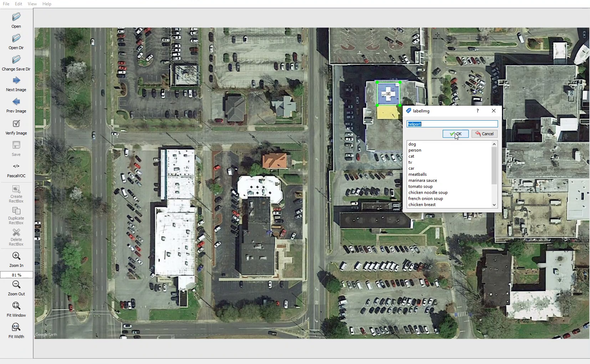

### 5 - Eğitim ve Test Verilerinin Oluşturulması

Ben 20|80 olarak test ve eğitim verilerimi ayırdım bu ayırdığımız verileri. "C:\bitirme\models\research\object_detection\images" dizini içerisindeki train ve test klasörlerine labelli halleri ile atıyoruz.

Daha sonra labellerimize ait csv dosyalarını oluşturmak için "C:\bitirme\models\research\object_detection" dizininde bulunan xml_to_csv.py dosyasını çalıştırıyoruz.

```
python xml_to_csv.py
```

Bu kod "C:\bitirme\models\research\object_detection\images" dizininde train_labels.csv ve test_labels.csv iki adet dosya üretecektir.

### 6 - Düzenleme İşlemleri

#### 6a. generate_tfrecord.py Dosyasının Düzenlenmesi ve .record dosyalarının oluşturulması.

"C:\bitirme\models\research\object_detection\generate_tfrecord.py" dosyası içerisindeki kodlar 31.satırdan itibaren bu şekilde düzenlendi.

```
# TO-DO replace this with label map
def class_text_to_int(row_label):
    if row_label == 'heliport':
        return 1
    elif row_label == 'ucak':
        return 2
    elif row_label == 'gemi':
        return 3
    else:
        None
```

.record dosyalarının oluşturulması için aşağıdaki komutlar sırasıyla çalıştırılır.

```
python generate_tfrecord.py --csv_input=images\train_labels.csv --image_dir=images\train --output_path=train.record
python generate_tfrecord.py --csv_input=images\test_labels.csv --image_dir=images\test --output_path=test.record
```

#### 6b. Labelmap.pbtxt Dosyasının Oluşturulması

"C:\tensorflow2\models\research\object_detection\training" dizininde uzantısı .pbtxt olan bir labelmap.pbtxt dosyasını oluşturuyoruz.

Bu dosyanın içerisine id ve name'leri generate_tfrecord.py dosyasında verdiğimiz düzene göre veriyoruz.

```
item {
  id: 1
  name: 'heliport'
}

item {
  id: 2
  name: 'ucak'
}

item {
  id: 3
  name: 'gemi'
}
```

#### 6c. faster_rcnn_inception_v2_pets.config Dosyasının Düzenlenmesi

"C:\bitirme\models\research\object_detection\samples\configs\faster_rcnn_inception_v2_pets.config" dosyasını "C:\bitirme\models\research\object_detection\training" dizini içerisine kopyalıyoruz.

"C:\bitirme\models\research\object_detection\training\faster_rcnn_inception_v2_pets.config" dosyasını açarak içerisindeki satırları şu şekilde düznliyoruz.

9. satırda sınıf sayısını veriyoruz benim 3 adet sınıfım var.

```
num_classes: 3
```

106. satırda model yolumuzu belirtiyoruz.

```
fine_tune_checkpoint: "C:/bitirme/models/research/object_detection/faster_rcnn_inception_v2_coco_2018_01_28/model.ckpt"
```

123. satırda train.record dosyamızın yolunu belirtiyoruz.

```
input_path: "C:/bitirme/models/research/object_detection/train.record"
```

125. satırda labelmap.pbtxt dosyamazın yolunu belirtiyoruz.

```
label_map_path: "C:/bitirme/models/research/object_detection/training/labelmap.pbtxt"
```

130. satırda test resimi sayısını belirtiyoruz.(Sadece resim sayısı)

```
num_examples: 86
```

135. satırda test.record dosyamızın yolunu belirtiyoruz.

```
input_path: "C:/bitirme/models/research/object_detection/test.record"
```

137. satırda labelmap.pbtxt dosyamazın yolunu belirtiyoruz.

```
label_map_path: "C:/bitirme/models/research/object_detection/training/labelmap.pbtxt"
```

### 7 - Eğitimi Başlatma

Tüm aşabalar doğu şekilde tamamlandıktan sonra eğitimi başlatıyoruz.

```
python train.py --logtostderr --train_dir=training/ --pipeline_config_path=training/faster_rcnn_inception_v2_pets.config
```

### 8 - Tensorboard Kullanarak Eğitim Kayıtlarını Görüntüleme

#### 8a. Tensorboard'ı Açma

Yeni bir Anaconda Promt açıyoruz.
Sanal ortama aktif ediyoruz.
"C:\bitirme\models\research\object_detection" dizinine gidiyoruz.

```
tensorboard --logdir=training
```

Bu komut bize localde :6006 portunda çalışan bir web sayfası oluşturuyor. Bu sayfaya giderek eğitime ait kayıtları görsel bir şekilde görüntüleyebiliriz.

#### 8b. Grafikler

**classification_loss** grafiği.
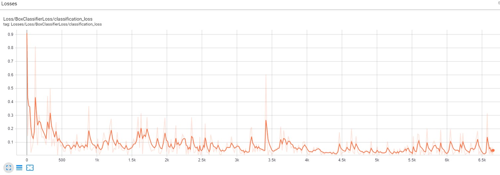

**localization_loss** grafiği.
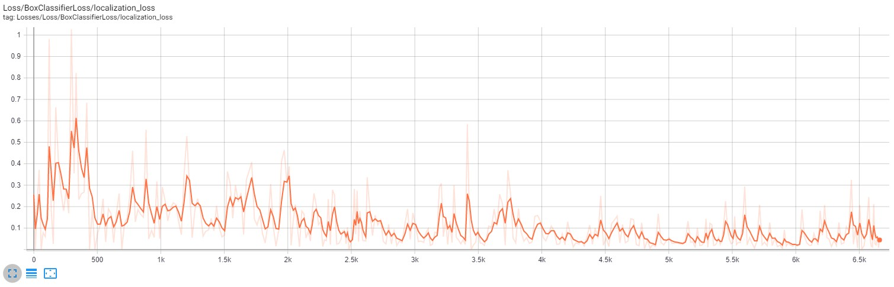

**TotalLoss** grafiği.
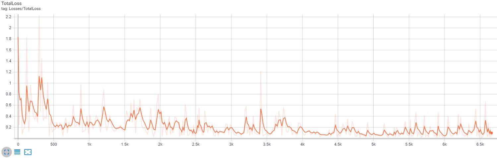

Ve daha birçok grafiği Tensorboard ile görüntüleyebilirsiniz.

### 9 - Inference Graf'ı Çıkarma.

Eğitimden aldığımız sonuç grafını çıkarmamız gerekiyor. Bunun için aşağıdaki komutu XXXX olan yerlere son eğitimin seri numarasını yazıyoruz.

```
python export_inference_graph.py --input_type image_tensor --pipeline_config_path training/faster_rcnn_inception_v2_pets.config --trained_checkpoint_prefix training/model.ckpt-XXXX --output_directory inference_graph
```

### 10 - Sonuçlar.

#### 10a. Resimden Hedef Tespiti

Hem **Uçak** hemde **Heliport** olan bir uydu görüntüsü testi.
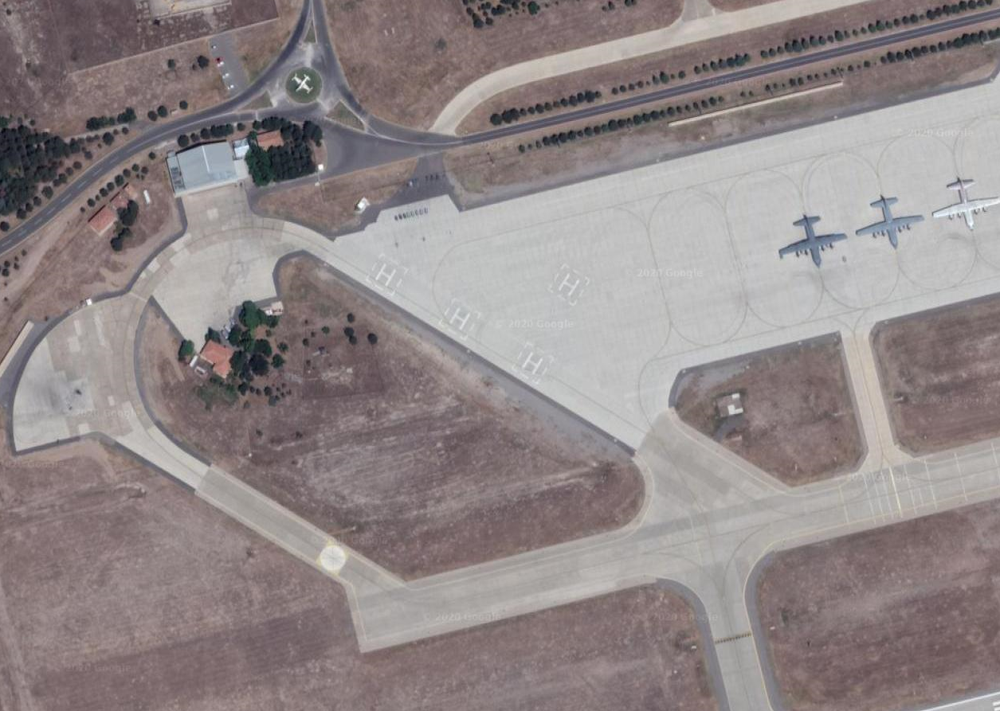
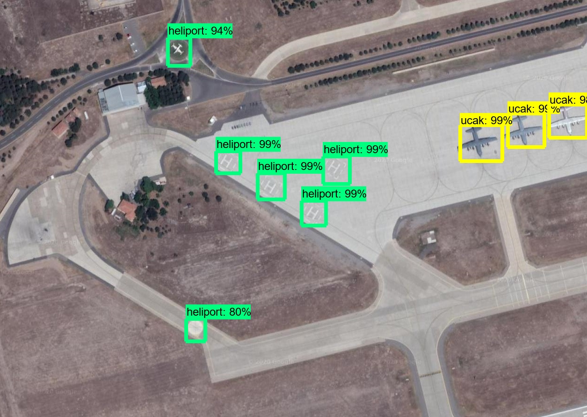

Hem **Uçak** hemde **Heliport** olan bir uydu görüntüsü testi.
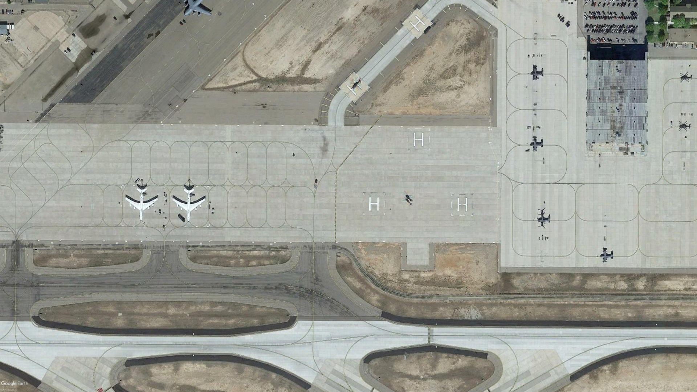
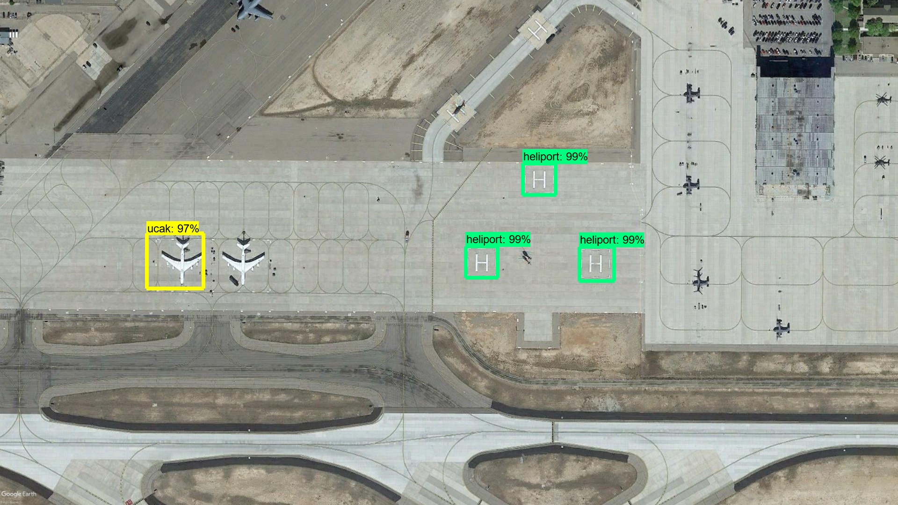

**Gemi** olan bir uydu görüntüsü testi.
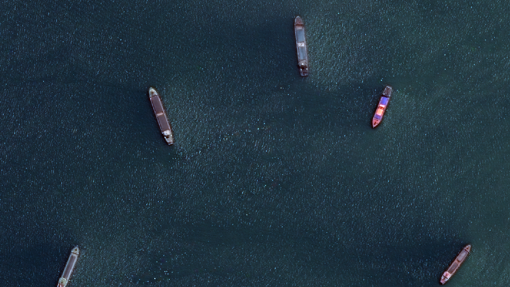
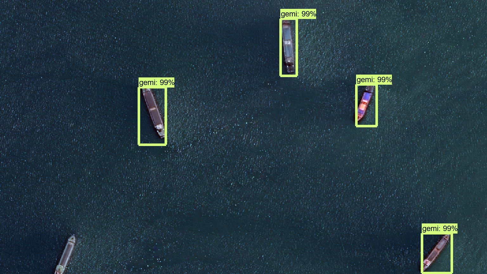

#### 10b. Videodan Hedef Tespiti

**Heliport** olan bir drone videosu testi.
[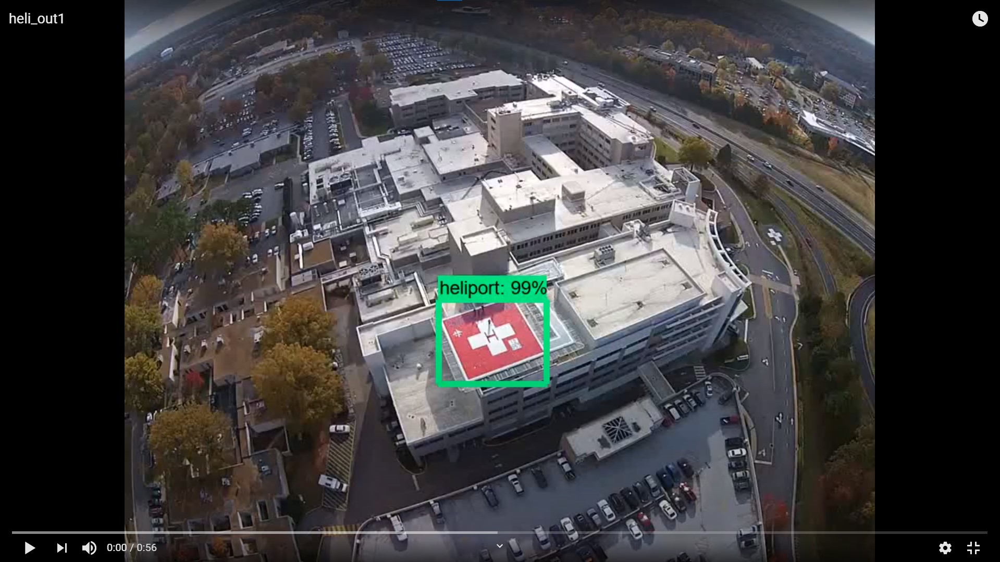](https://youtu.be/QcU-lHf22pE)


